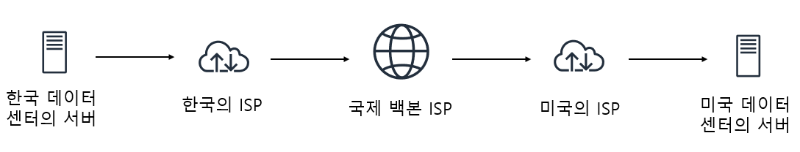

## 1.1 인터넷이란 무엇인가?

이 책은 컴퓨터 네트워크와 프로토콜을 설명하기 위해서  
컴퓨터 네트워크의 종류 중 하나인 '인터넷'을 통해 내용을 전개합니다.  

이 장에서는 컴퓨터 네트워크에 중요한 역할을 하는  
인터넷과 프로토콜에 대한 뼈대를 잡습니다.

---

### 인터넷을 설명

인터넷은 2가지 방법으로 설명할 수 있습니다.  
1번째는 구성요소에 대한 관점,  
2번째는 서비스에 대한 관점.  

순서대로 작성하겠습니다.

#### 구성요소로 본 인터넷

인터넷은 컴퓨팅 장치들을 연결하기 위한 컴퓨터 네트워크입니다.  
컴퓨팅 장치에는 host와 end system이 있습니다.

end system은 물리 매체를 담당하는 링크와  
목적지를 설정해주는 스위치의 네트워크로 연결됩니다.  

end system에서 전송되는 데이터는 패킷이라는 이름으로 나가게 됩니다.

전송되는 데이터는 정해진 수만큼의 세그먼트로 분리되고,
각 세그먼트에 헤더가 붙게되면서 패킷이 됩니다.

전송된 패킷은 수신 end system에서 다시 하나로 모이면서  
데이터를 이루게 됩니다.

링크와 스위치의 네트워크는 하나의 ISP(Internet Service Provider)를 이룰 수 있습니다.  

end system은 여러가지 ISP (가정, 법인, 대학, 공공 와이파이 제공, ...)를 통해서 인터넷에 접속할 수 있고,  
ISP와 ISP의 연결을 통해서 end system은 또 다른 end system과도 연결될 수 있습니다.

아래는 한국에 있는 서버가 미국에 있는 서버에  
데이터를 전송할때 어떤 요소들이 어떻게 동작하는지 정리해본 과정입니다.  

#### 서비스 측면에서 본 인터넷

위에서는 인터넷을 구성하는 여러 요소에 대해 살펴봤습니다.  
하지만, 인터넷을 또 서비스적인 관점인  
애플리케이션에 서비스를 제공하는 인프라스트럭처로서도 기술할 수 있습니다.  

애플리케이션은 end system에서만 실행될 수 있기에  
개발자는 end system에서 실행되는 프로그램을 개발해야 합니다.  
(front-end, back-end)  

이 end system끼리 데이터를 통신하기 위해서는  
인터넷이 인프라스트럭처의 역할을 해야만 합니다.

하지만, 어떻게 데이터를 통신하도록 지시할 수 있을까요?  

이를 위해 소켓 인터페이스가 사용됩니다.  
소켓 인터페이스는 송신 프로그램이 따라야 하는 규칙의 집합이며  
인터넷은 이 규칙에 따라 데이터를 목적지 프로그램으로 전달하게 됩니다. 

---

### 프로토콜은 무엇인가?

위의 인터넷이 무엇인지에 대한 설명을 통해  
인터넷에 대한 대략적인 내용을 정리했습니다.  

그럼 이제 프로토콜에 대한 대략적인 정리를 하겠습니다.

프로토콜은 통신하는 개체의 인터넷에서의 활동을 제어하기 위해 사용됩니다.  

예를 들어, end system의 혼잡 제어 프로토콜은 패킷 전송률을  
조절함으로써 더 원활한 통신이 되게 해주고,  
라우터의 프로토콜은 출발지에서 목적지로 패킷 경로를 설정해줌으로써  
통신을 가능하게 해줍니다.  

이처럼 프로토콜은 여러 통신 개체 간에 교환되는 메시지 포멧과  
순서뿐만 아니라, 메시지의 송수신과 다른 이벤트에 따른 행동들을  
정의함으로써 네트워크에서의 통신을 제어해주는 역할을 합니다.